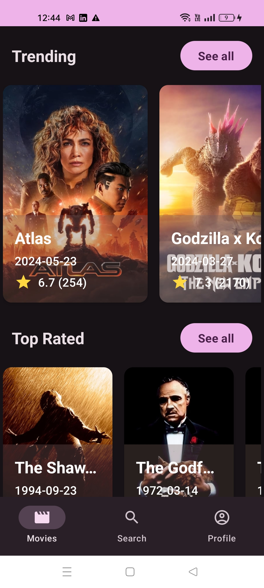
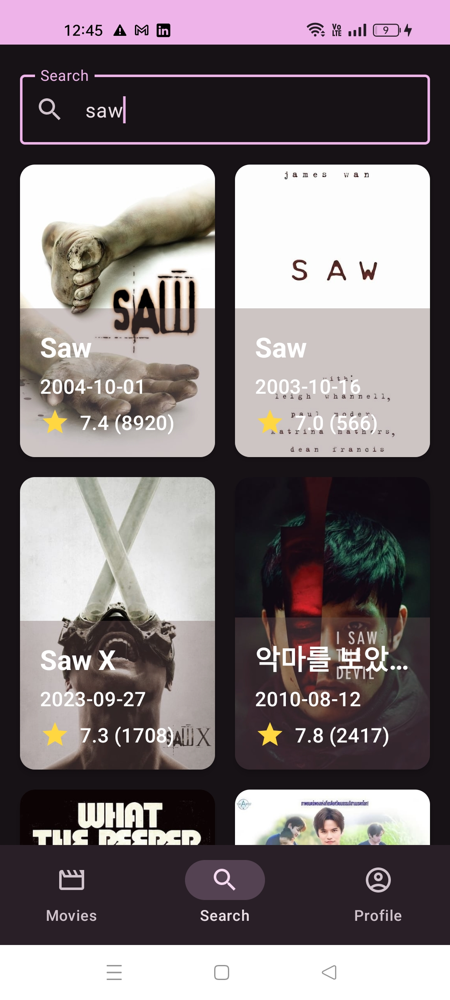
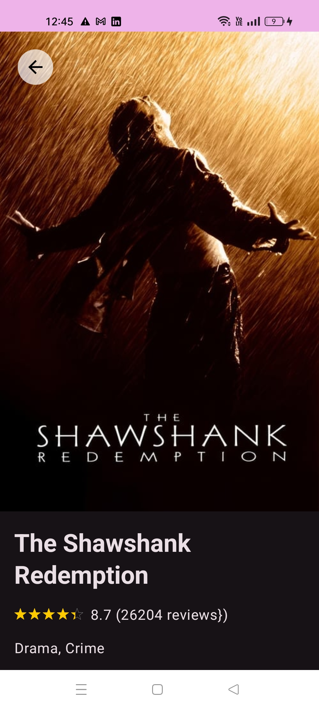
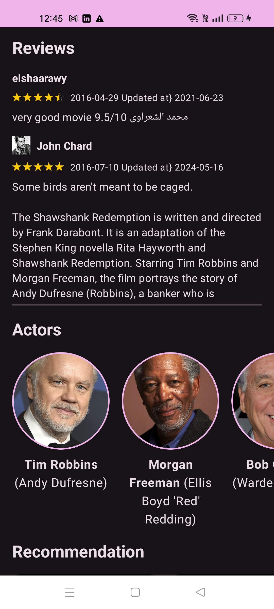

# Jetpack Compose - TMDB-Movies

# Clean Architecture App

An Android app consuming TMDB API to display movies.
it has been built with clean architecture principles, Repository Pattern and MVI
pattern with jetpack compose.

## Tech Stack

*  Jetpack compose
*  MVI pattern
*  Unit testing
*  Coil
*  Retrofit

## Screenshots

|  |  |  |  |
|:-----------------------------------:|:-------------------------------------:|:-----------------------------------:|:----------------------------------------:|